# AEFI - Data Entry Guide { #aefi-data-entry-guide }

**DHIS2 Immunization Toolkit**

**Adverse Events Following Immunization (AEFI)**

## Register a New Case

=== "Step 1"

    Open the Tracker Capture app

    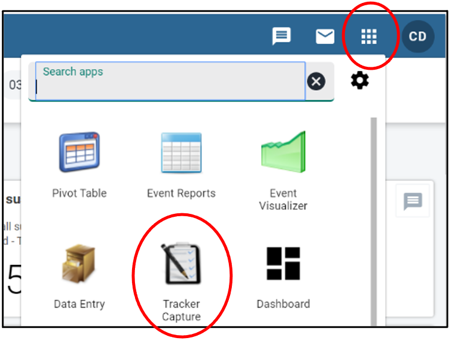

    1. Click on the "Apps" icon
    2. Click on the "Tracker Capture" app

=== "Step 2"

    Register the person

    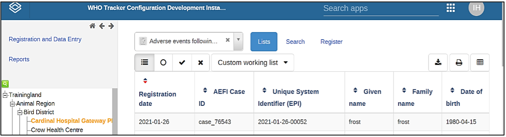

    1. Select the facility
    2. Select “Adverse events following immunization” program
    3. Click on "Register"

=== "Step 3"

    Enter attributes

    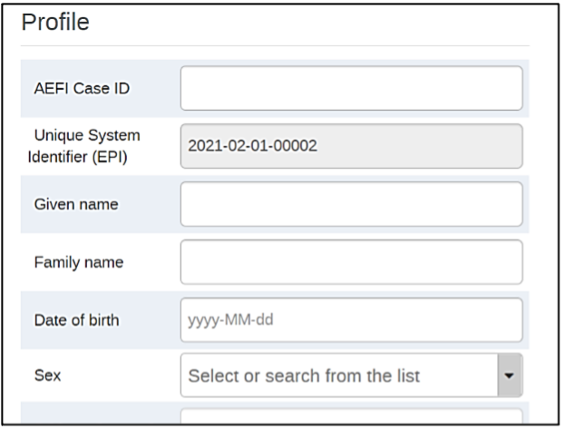

    1. Enter the details of your person taken from the reporting form

=== "Step 4"

     Click on "Save and continue" to proceed to the "Data Entry" section

    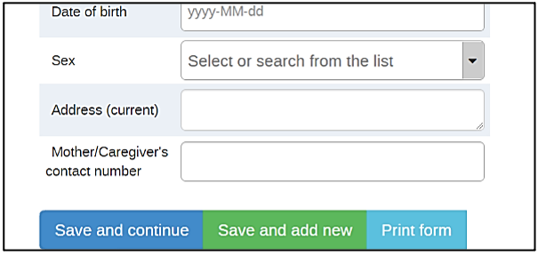

## Data Entry - AEFI

=== "Step 1"

    With the AEFI stage open, select a date of the event to begin data entry. 

    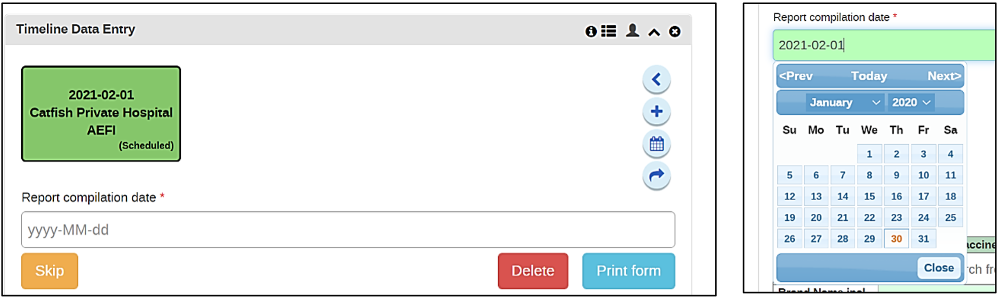

=== "Step 2"

    Fill in the details for Reporter, Vaccine, Adverse Events and Outcome.

    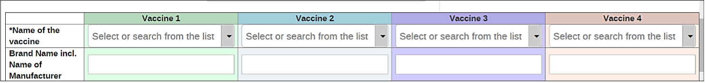

    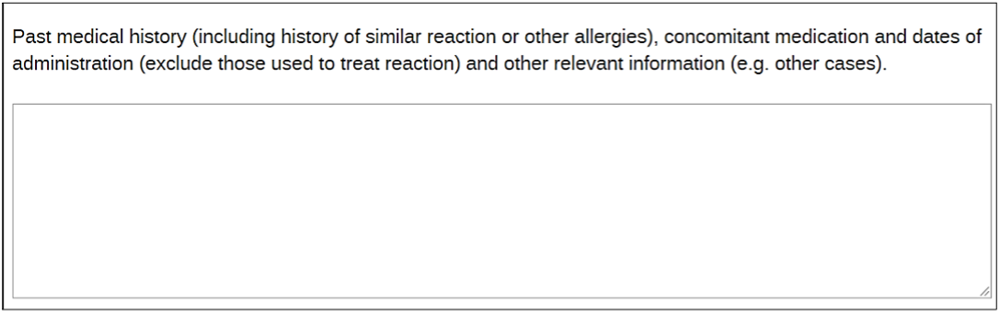

    1. Select from dropdown options or fill in text where necessary.

    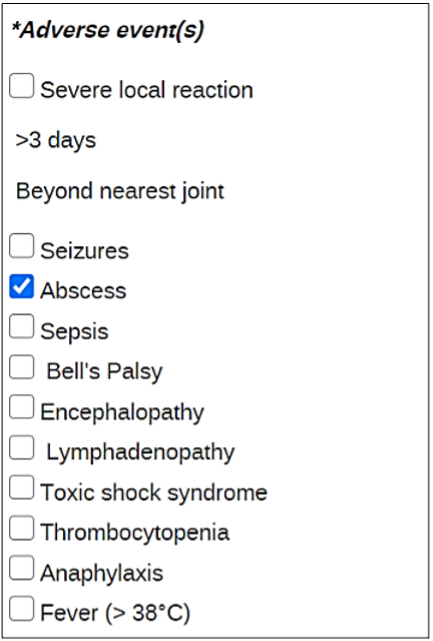

    1. Select the relevant symptoms.

=== "Step 3"

    Complete the event

    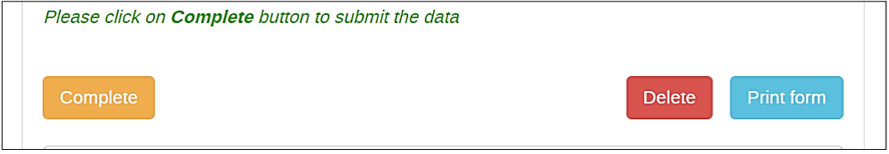

## Data Entry – First Decision Making Level

=== "Step 1"

    Click on the "+" sign to start adding a new event

    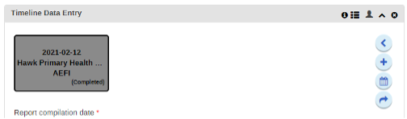

=== "Step 2"

    Select the first decision making level stage from the list

    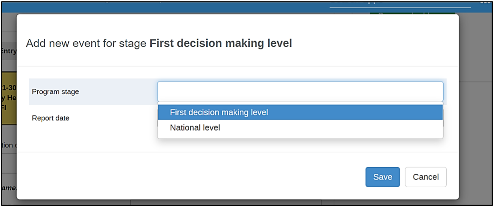

=== "Step 3"

    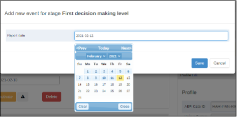

    1. Select the date
    2. Click on “Save” in order to save the event

=== "Step 4"

    The new event will show in the timeline and you can enter the related data.

    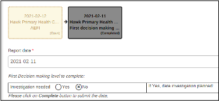

    1. The new event form is now available for data entry

## Data Entry – National Level

=== "Step 1"

    Click on the ‘+’ sign

    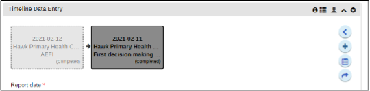

=== "Step 2"

    Select the national level stage from the list

    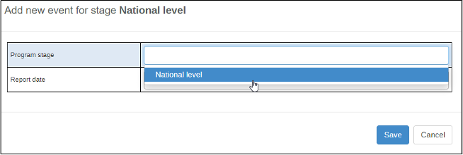

=== "Step 3"

    

    1. Select the date
    2. Click on “Save” in order to save the event

=== "Step 4"

    The new event will show in the timeline and you can enter the related data.

    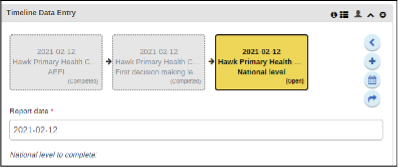

    1.The new event form is now available for data entry
    2. Click on “Save” in order to save the event

## Searching for a Case

=== "Step 1"

    Open the Tracker Capture app

    

    1. Click on the "Apps" icon
    2. Click on the "Tracker Capture" app

=== "Step 2"

    Start the Search process

    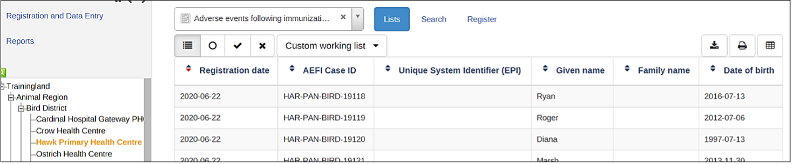

    1. Select the facility
    2. Select "Adverse events following immunization"

=== "Step 3"

    Select the “Active” filter

    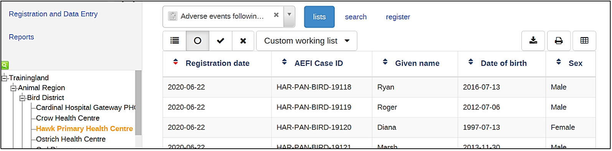

=== "Step 4"

Select your person from the front-page list to be taken to their dashboard

    

## Using the Custom Working List

=== "Step 1"

    Open the Tracker Capture app

    

    1. Click on the "Apps" icon
    2. Click on the "Tracker Capture" app

=== "Step 2"

    Start the Search process

    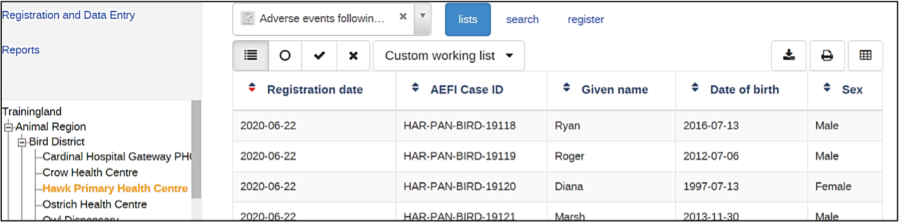

    1. Select the facility
    2. Select "Adverse events following immunization"
    3. Click on "Custom Working List"

=== "Step 3"

    Select the custom working list options

    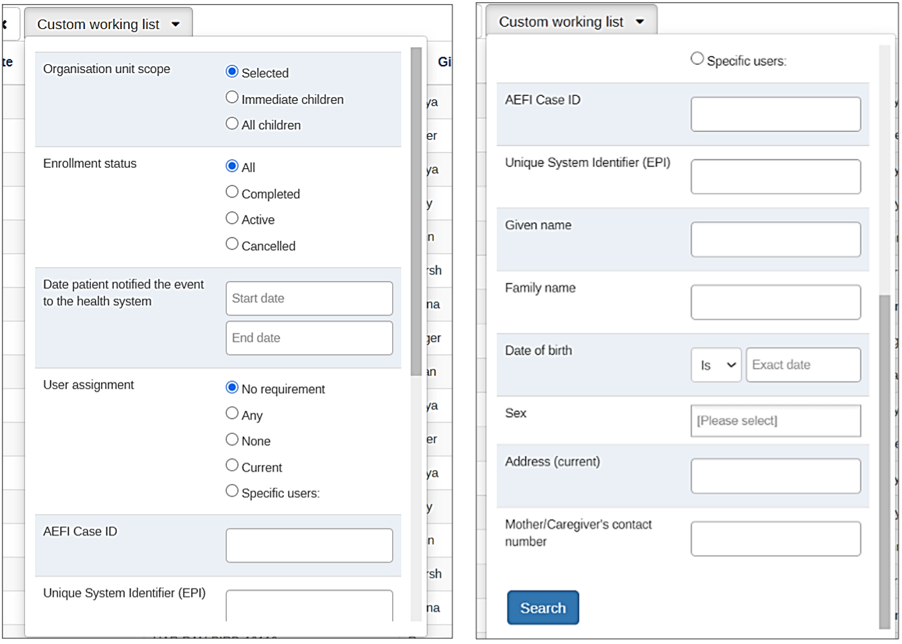

    1. Set the Custom working filters as required by your case
    2. Scroll down and select Search

=== "Step 4"

    Select your person from the front-page list to be taken to their dashboard

    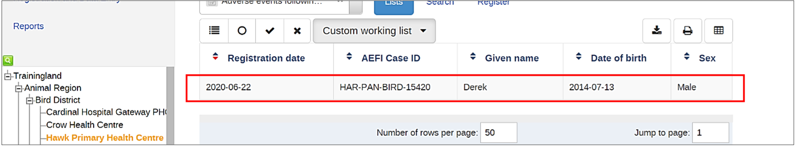

## Completing the Enrollment

=== "Step 1"

    Scroll to the top of the cases dashboard until you see the Enrollment box

    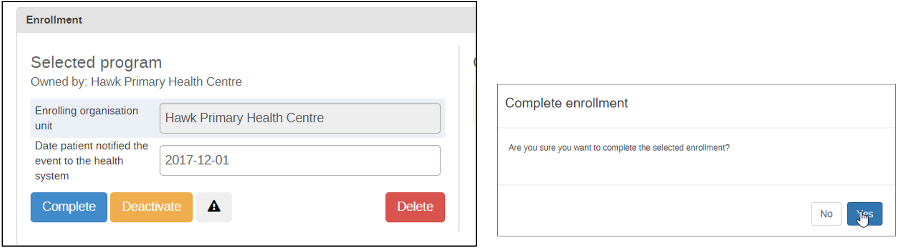

=== "Step 2"

    Complete the enrollment

    

    1. Select the complete button
    2. Confirm that you want to complete the enrollment

=== "Step 3"

    Exit the case's dashboard by using the back button

    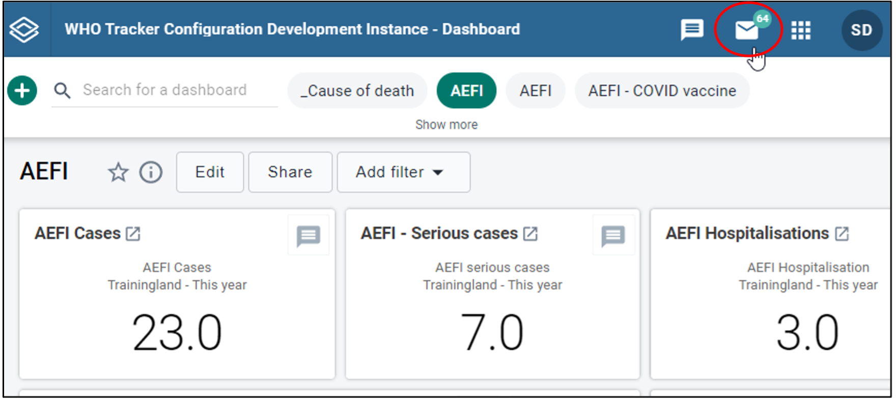

## Reviewing Notifications

=== "Step 1"

    From the dashboard, select the messages icon

    

=== "Step 2"

    Open the Message

    

    1. Select the system tab
    2. Select the message

=== "Step 3"

    Review the Message

    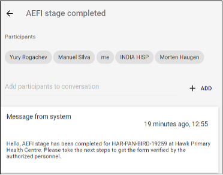
