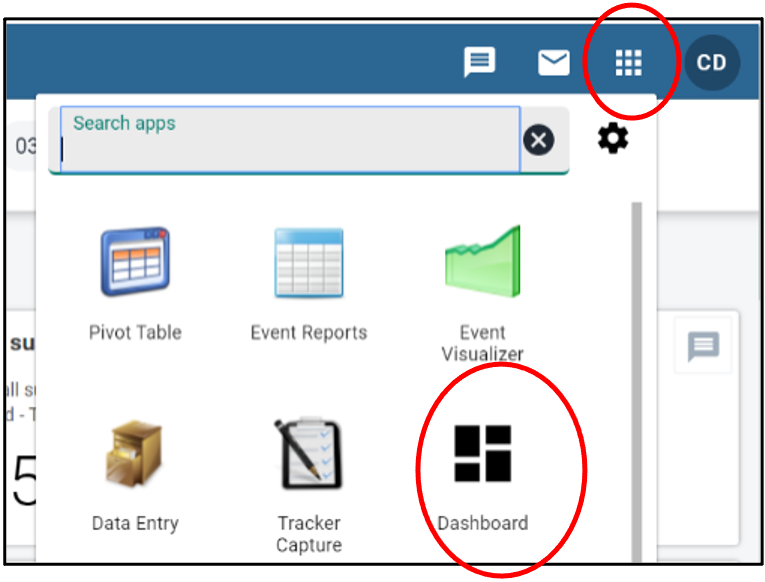
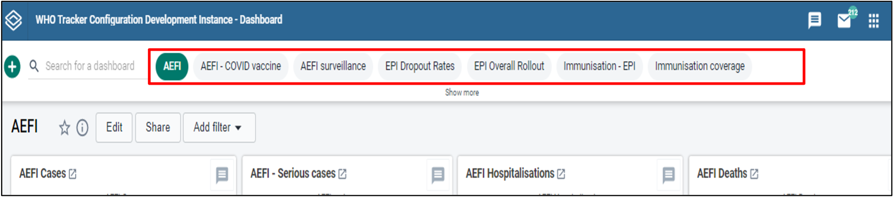
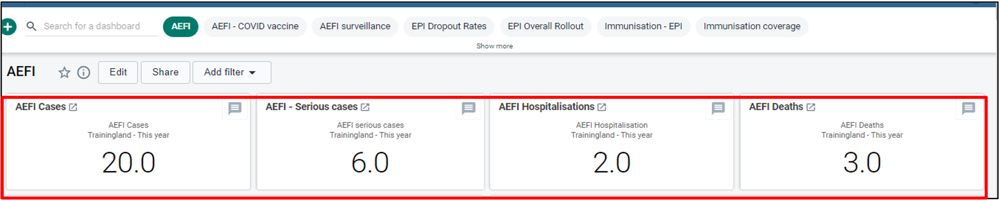
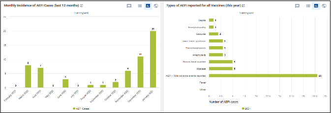
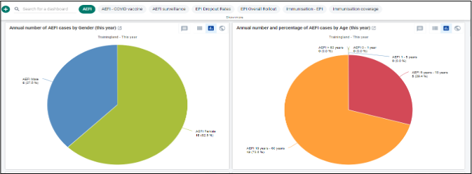
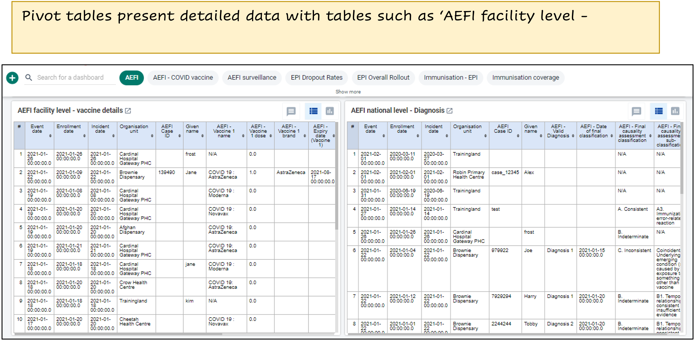
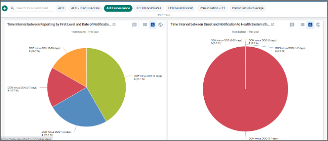

# AEFI - Dashboard Navigation

**DHIS2 Immunization Toolkit**

**Adverse Events Following Immunization (AEFI)**

=== "Step 1"

    Open the Dashboard app

    

    1. Click on the "Apps" icon
    2. Click on the "Dashboard" app

=== "Step 2"

    Switching tabs on the dashboard

    

    Toggle between the dashboard tabs from this bar on the top

=== "Step 3"

    The AEFI tab/dashboard

    

    Displays the recent stats on the top

    

    Horizontal and Vertical Bar graphs present data such as "Monthly Incidence of AEFI Cases (last 12 months)’ and ‘Types of AEFI reported for all Vaccines

    

    Pie charts present data such as "Annual number of AEFI cases by Gender" and "Annual number and percentage of AEFI cases by Age"

    

    Pivot tables present detailed data with tables such as "AEFI facility level - vaccine details" and "AEFI national level - Diagnosis"

=== "Step 4"

    Switching to AEFI surveillance tab/dashboard

    

    Select ‘AEFI surveillance’ from the tab to view its components
    
    

    Pie charts such as "Time Interval between Reporting by First Level and Date of Notification" and "Time Interval between Onset and Notification to Health System" are found in AEFI surveillance
